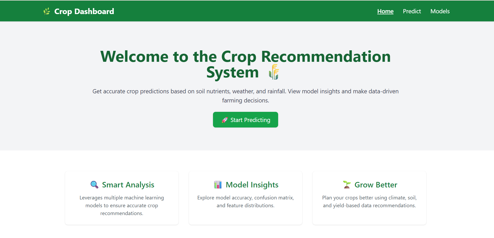
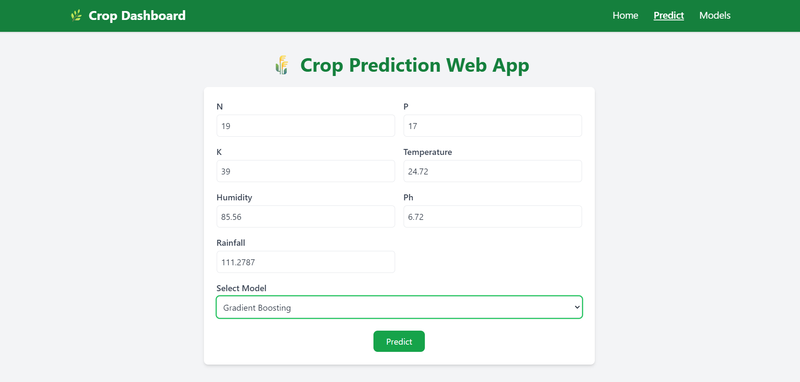
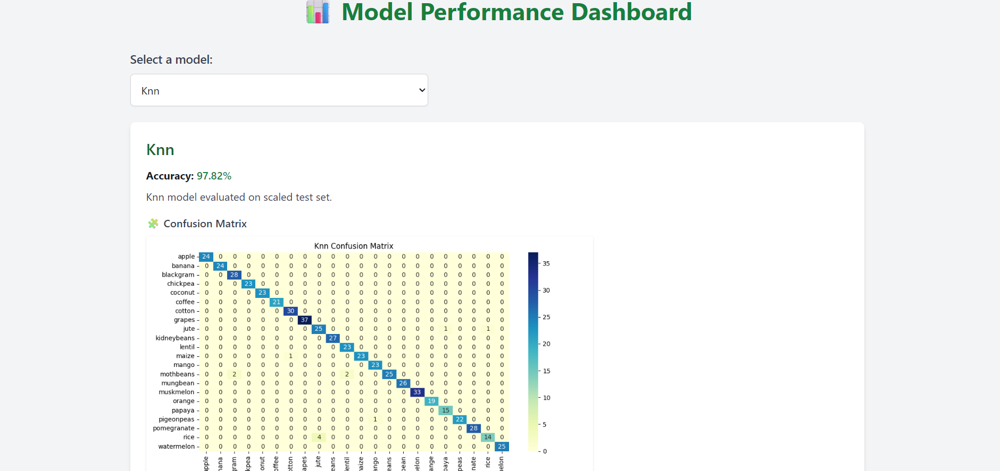
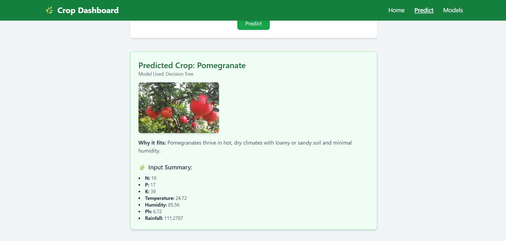

# 🌾 AI-Based Crop Recommendation System

An intelligent web application that recommends the most suitable crop based on soil nutrients and environmental conditions using Machine Learning algorithms. The system analyzes agricultural parameters and predicts the best crop to support smart farming and improve agricultural productivity.

---

## 🚀 Features

- 🌱 Crop recommendation based on N, P, K, temperature, humidity, pH, and rainfall.
- 🤖 Multiple Machine Learning models for prediction.
- 📊 Model performance comparison and evaluation.
- 📈 Interactive data visualization dashboard.
- 🧠 Agricultural insights generated from dataset analysis.
- 🎨 Modern and responsive user interface.
- ⚡ Fast and accurate crop prediction.

---

## 📸 Screenshots

### Home Page



### Prediction Page



### Model Dashboard



### Prediction Result



---

## 🧩 Project Structure

```text
├── app.py
├── crop_info.py
├── generate_insights.py
├── README.md
├── .gitignore
│
├── data/
│   └── data.csv
│
├── model/
│   ├── train_model.py
│   ├── knn.pkl
│   ├── random_forest.pkl
│   ├── scaler.pkl
│   └── trained model files
│
├── static/
│   ├── charts/
│   └── images/
│
└── templates/
    ├── home.html
    ├── predict.html
    └── models.html
```

---

## ⚙️ Setup Instructions

### 1. Clone the Repository

```bash
git clone https://github.com/sambram23/crop-recommendation-system.git
cd crop-recommendation-system
```

### 2. Create a Virtual Environment

```bash
python -m venv venv
```

### 3. Activate Virtual Environment

#### Windows

```bash
venv\Scripts\activate
```

#### Linux / macOS

```bash
source venv/bin/activate
```

### 4. Install Dependencies

```bash
pip install -r requirements.txt
```

### 5. Train the Models

```bash
python model/train_model.py
```

### 6. Generate Insights

```bash
python generate_insights.py
```

### 7. Run the Application

```bash
python app.py
```

### 8. Open in Browser

```text
http://localhost:5000
```

---

## 📊 Input Parameters

The prediction model uses:

- Nitrogen (N)
- Phosphorus (P)
- Potassium (K)
- Temperature
- Humidity
- pH Level
- Rainfall

---

## 🤖 Machine Learning Models

- K-Nearest Neighbors (KNN)
- Support Vector Machine (Linear)
- Support Vector Machine (RBF)
- Support Vector Machine (Polynomial)
- Decision Tree
- Random Forest
- Gradient Boosting

---

## 🎯 Objectives

- Assist farmers in selecting suitable crops.
- Improve agricultural decision-making using Machine Learning.
- Provide visual insights into agricultural datasets.
- Demonstrate the practical application of AI in agriculture.

---

## 🛠️ Tech Stack

- Python
- Flask
- Scikit-Learn
- Pandas
- NumPy
- Plotly
- Matplotlib
- HTML
- CSS
- Tailwind CSS

---

## 🌐 Repository

https://github.com/sambram23/crop-recommendation-system

---

## 📜 License

This project is intended for educational, research, and learning purposes.